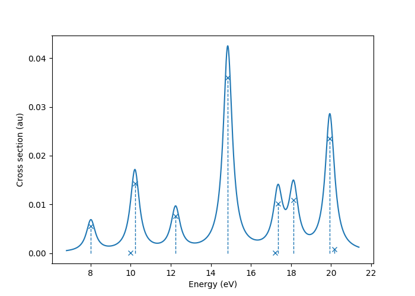
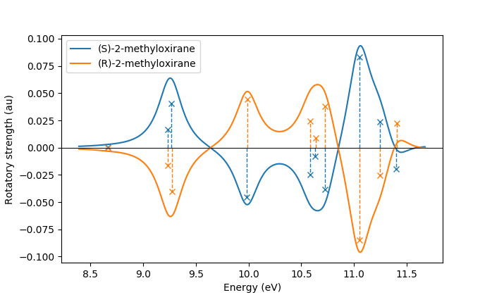

:github_url: https://github.com/adc-connect/adcc/blob/master/docs/calculations.rst

.. _performing-calculations:

Performing calculations with adcc
=================================

This section gives a practical guide for performing ADC calculations with adcc.
It deliberately does not show all tricks and all tweaks,
but instead provides a working man's subset of selected features.
To checkout the full API with all details of the mentioned functions and
classes, see the advanced topics or the :ref:`API reference <pyapi>`.

Overview of supported features
------------------------------
Currently adcc supports all ADC(n) variants up to level 3,
that is **ADC(0)**, **ADC(1)**, **ADC(2)**, **ADC(2)-x** and **ADC(3)**.
For each of these methods, basic state properties and transition properties
such as the state dipole moments or the oscillator strengths are available.
More complicated analysis can be performed in user code by requesting
the full state and transition density matrices e.g. as NumPy arrays.

The code supports the **spin-flip** variant of all aforementioned methods
and furthermore allows the **core-valence separation** (CVS),
**frozen-core** (FC) and **frozen-virtual** (FV) approximations
to be applied. Arbitrary combinations of these variants,
e.g. applying **both** CVS and FC approximations are supported as well.
See :ref:`frozen-spaces` for details.

Calculations with :ref:`polarisable_embedding` and the :ref:`polarisable_continuum`
for implicit solvation are also supported.

General ADC(n) calculations
---------------------------
General ADC(n) calculations,
that is calculations without any additional approximations,
are invoked on a SCF reference by passing it
to a function from adcc, which resembles the name of the method.
In this sense :func:`adcc.adc0` performs an ADC(0) calculation,
whereas :func:`adcc.adc3` performs an ADC(3) calculation.
The distinction between ADC(2) and ADC(2)-x is made
by using either :func:`adcc.adc2` or :func:`adcc.adc2x`.

Let us return to our :ref:`index-example`,
where we performed a cc-pVTZ ADC(3) calculation of water:

.. code-block:: python

    from pyscf import gto, scf
    import adcc
    
    # Run SCF in pyscf
    mol = gto.M(
        atom='O 0 0 0;'
             'H 0 0 1.795239827225189;'
             'H 1.693194615993441 0 -0.599043184453037',
        basis='cc-pvtz',
        unit="Bohr"
    )
    scfres = scf.RHF(mol)
    scfres.conv_tol = 1e-13
    scfres.kernel()
    
    # Run an ADC(3) calculation, solving for 3 singlets
    state = adcc.adc3(scfres, n_singlets=3)

If we run this code, we first get some output from PySCF like::

    converged SCF energy = -76.0571904154804

and afterwards see a convergence table such as::

    Starting adc3  singlet Jacobi-Davidson ...
    Niter n_ss  max_residual  time  Ritz values
      1     6       0.28723   2.5s  [0.42804006 0.50764932 0.50832029]
      2    12      0.036665   5.2s  [0.31292983 0.38861435 0.39597989]
      3    18     0.0022763   4.4s  [0.30538169 0.37872815 0.38776093]
      4    24    0.00076294   5.2s  [0.30444427 0.3770635  0.38676531]
      5    30    4.1766e-05   5.2s  [0.30432968 0.37681918 0.38663898]
    === Restart ===
      6    12    6.6038e-06   5.0s  [0.30432361 0.37680258 0.38663161]
      7    18    6.7608e-07   5.4s  [0.30432287 0.37679979 0.38663062]
    === Converged ===
        Number of matrix applies:    84
        Total solver time:            32s 818ms

There are a few things to note here:

* There was no need to explicitly pass any information
  about the molecular geometry or the basis set directly to adcc.
  The only thing adcc needs to get going is the *converged* SCF result
  contained in the ``scfres`` object in the above code example.
* Apart from the SCF result in ``scfref``, the :func:`adcc.adc3` method takes
  extra keyword arguments such as ``n_singlets`` in this case. These arguments
  allow to specify, which and how many states to compute, how accurate
  this should be done and which algorithms to use.
  These arguments will be discussed in detail in this section.
* The Jacobi-Davidson convergence table allows to monitor the convergence
  as the calculation proceeds. ``n_ss`` refers to the number of vectors
  in the subspace. The more vectors in the subspace, the more costly
  a single iteration is, but the faster the calculation typically
  converges. The implementation in adcc makes a compromise,
  by shrinking the subspace (called a ``=== Restart ===``) after a few
  iterations. The ``max_residual`` provides a measure for the
  remaining numerical error. ``time`` gives a rough idea for the
  time needed for the displayed iteration.
  Lastly ``Ritz values`` provides the current estimates to the excitation
  energies (in Hartree). Only the first few requested excitations
  are displayed here.
* The final lines inform about the number of times the ADC(3)
  matrix had to be applied to some vectors (i.e. the number of
  matrix-vector products with the ADC matrix, which had to be
  computed). It also shows the total time for the Jacobi-Davidson solver in order
  to converge the requested states. Typically the runtime is directly
  related to the number of such applies and this number should therefore
  be used when trying to identify a suitable set of adcc parameters for converging
  a calculation.

There is of course no need to use PySCF for the Hartree-Fock reference.
We could have done exactly the same thing using Psi4 as the SCF driver, e.g.

.. code-block:: python

    import psi4
    
    # Run SCF in Psi4
    mol = psi4.geometry("""
        O 0 0 0
        H 0 0 1.795239827225189
        H 1.693194615993441 0 -0.599043184453037
        symmetry c1
        units au
    """)
    psi4.core.be_quiet()
    psi4.set_options({'basis': "cc-pvtz", 'e_convergence': 1e-13, 'd_convergence': 1e-7})
    scf_e, wfn = psi4.energy('SCF', return_wfn=True)
    
    # Run an ADC(3) calculation in adcc, solving for 3 singlets
    state = adcc.adc3(wfn, n_singlets=3)

which will give rise to a similar Davidson convergence than before.
In either case the ``state`` object, which was returned
from the :func:`adcc.adc3` function now contains the resulting states
and can be used to compute excited states properties
or analyse the states further, see the sections :ref:`plotting-spectra`
and :ref:`computed-data` below.
A good summary about the states is available using the :func:`adcc.ExcitedStates.describe()`
method, like so::

   print(state.describe())

This returns a table, such as::

    +--------------------------------------------------------------+
    | adc3 (adc2)                             singlet ,  converged |
    +--------------------------------------------------------------+
    |  #        excitation energy     osc str    |v1|^2    |v2|^2  |
    |          (au)           (eV)                                 |
    |  0     0.3043229      8.281047   0.0378    0.9428   0.05721  |
    |  1     0.3767998      10.25324   0.0000    0.9449   0.05514  |
    |  2     0.3866306      10.52076   0.1000    0.9418   0.05823  |
    +--------------------------------------------------------------+

The first line of this table contains a reminder and summary of the
calculation we performed, namely we did an ADC(3) calculation
and requestet singlets. Further we are informed that the calculation
converged successfully. An unseccessful calculation would instead print
``NOT CONVERGED``. Some extra explaination needs the printout
``adc3 (adc2)``. Here the ``adc2`` inside the brackets indicates
the ADC level at which properties are computed.
Currently adcc only has ADC(3) expressions for the excited state
energies and excitation vectors implemented and the property calculation,
such as the oscillator strength, is thus only done at the ADC(2) level.

Apart from this, the state table summarises, for each state,
the ``excitation energy`` in Hartree and electron volts,
their oscillator strength as well as
the square norm of the singles (``|v1|^2``) and doubles (``|v2|^2``)
parts of the corresponding excitation vectors.

A quick overview of the dominating orbitals involved in the
determined excitations, can also be obtained very easily.
For this simply print the string returned by
the :func:`adcc.ExcitedStates.describe_amplitudes()`
method, i.e. ``print(state.describe_amplitudes())``.
In our case it would produce a table such as::

    +-------------------------------------------------------+
    | State   0 ,     0.3043779 au,      8.282543 eV        |
    +-------------------------------------------------------+
    | HOMO            -> LUMO             a ->a      -0.675 |
    | HOMO            -> LUMO +3          a ->a      +0.094 |
    | HOMO            -> LUMO +4          a ->a     -0.0674 |

    ...

    +-------------------------------------------------------+
    | State   1 ,     0.3768004 au,      10.25326 eV        |
    +-------------------------------------------------------+
    | HOMO            -> LUMO +1          a ->a      +0.663 |
    | HOMO            -> LUMO +2          a ->a       +0.14 |
    | HOMO            -> LUMO +6          a ->a      -0.112 |

    ...

    +-------------------------------------------------------+
    | State   2 ,     0.3866926 au,      10.52244 eV        |
    +-------------------------------------------------------+
    | HOMO -1         -> LUMO             a ->a      +0.675 |
    | HOMO -1         -> LUMO +3          a ->a     -0.0902 |
    | HOMO -1         -> LUMO+10          a ->a      -0.035 |
    | HOMO -1         -> LUMO +4          a ->a     +0.0338 |

    ...

In the tables a few lines have been cute near the ``...`` for clearity.

Without a doubt, ADC(3) is a rather expensive method,
taking already noticable time for a simple system such as
a triple zeta water calculation. For comparison an equivalent ADC(1)
calculation, started with

.. code-block:: python

    state = adcc.adc1(scfres, n_singlets=3)

on top of the same PySCF reference state, gives rise to::

    Starting adc1  singlet Jacobi-Davidson ...
    Niter n_ss  max_residual  time  Ritz values
      1     6       0.01356  116ms  [0.355402   0.43416334 0.43531311]
      2    12     0.0019488   41ms  [0.33653051 0.40287876 0.41843608]
      3    18    1.9961e-05   65ms  [0.33603959 0.40167202 0.41791942]
      4    24    2.7046e-07   69ms  [0.33603543 0.40166584 0.41791101]
    === Converged ===
        Number of matrix applies:    48
        Total solver time:           295.018ms

on the same machine, i.e. is both faster per iteration
and needs less iterations in total.
Other means to influence the calculation runtime
and determine the number and kind of states to compute
is discussed in the next section.

Calculation parameters
----------------------

:ref:`adcn-methods`
(such as :func:`adcc.adc1` and :func:`adcc.adc3` above)
each take a number of arguments:

- **n_singlets**, **n_triplets** and **n_states**
  control the number and kind of states to compute.
  ``n_singlets`` and ``n_triplets`` are only available for restricted
  references and ensure to only obtain singlets or triplets in the ADC
  calculations. ``n_states`` is available for all references and does
  not impose such a restriction. E.g.

  .. code-block:: python

     state = adcc.adc2(scfres, n_singlets=6)

  would compute six excited states, which could have any spin.
  In the case of unrestricted references they will most likely
  not be spin-pure.
- **conv_tol** (convergence tolerance)
  specifies the tolerance on the ``max_residual``
  in the Jacobi-Davidson scheme. It thus influences the numerical
  accuracy of the calculations. More accurate calculations take
  longer, especially to reach tolerances below ``1e-8`` can become very slow.
  The default value is ``1e-6``, which is usually
  a good compromise between accuracy and runtime.

  .. note::
     Requesting more accurate ADC(n) calculations also requires
     the SCF reference to be computed to at least this accuracy.
     adcc will print an error if this is not the case.

- **max_subspace** (maximal subspace size)
  specifies the maximal number of subspace vectors in the Jacobi-Davidson
  scheme before a restart occurs. The defaults are usually good,
  but do not be shy to increase this value if you encounter convergence problems.
- **n_guesses** (Number of guess vectors):
  By default adcc uses twice as many guess vectors as states to be computed.
  Sometimes increasing this value by a few vectors can be helpful.
  If you encounter a convergence to zero eigenvalues, than decreasing this
  parameter might solve the problems.
- **max_iter** (Maximal number of iterations)
  The default value (70) should be good in most cases. If convergence
  does not happen after this number of iterations, then usually something
  is wrong anyway and the other parameters should be adjusted.
- **output**: Providing a parameter ``output=None`` silences the ADC run
  (apart from warnings and errors) and only returns the converged result.
  For example:

  .. code-block:: python

     state = adcc.adc2(scfres, n_singlets=3, output=None)

Parallelisation in adcc
-----------------------

On startup, adcc automatically inspects the computer hardware
and from this selects the number of threads to use for computations.
Unless this fails, one thread per CPU core is employed,
such that the computation runs in parallel on all cores.
If this is not what you want, e.g. because you use adcc on a cluster and
only part of the available cores are allocated to you,
you need to explicitly reduce the number of employed threads.
For example, in order to make adcc use only 8 threads,
i.e. occupy only 8 CPU cores, you have to run

.. code-block:: python

   adcc.set_n_threads(8)

before calling any of :ref:`adcn-methods` or doing any other
computation with ``adcc``.
The current number of threads available to adcc can be similarly
obtained using the function ``adcc.get_n_threads()``.

.. _plotting-spectra:

Plotting spectra
----------------

.. note::
     For plotting spectra, `Matplotlib <https://matplotlib.org>`_
     needs to be installed. See :ref:`optional-dependencies` for details.

Having computed a set of ADC excited states as discussed in the
previous sections, these can be visualised
in a simulated absorption spectrum
as shown in the next example.

.. code-block:: python

   from matplotlib import pyplot as plt
   from pyscf import gto, scf
   import adcc

   # pyscf-H2O Hartree-Fock calculation
   mol = gto.M(
       atom='O 0 0 0;'
            'H 0 0 1.795239827225189;'
            'H 1.693194615993441 0 -0.599043184453037',
       basis='cc-pvtz',
       unit="Bohr"
   )
   scfres = scf.RHF(mol)
   scfres.conv_tol = 1e-13
   scfres.kernel()

   # Compute 10 singlets at ADC(2) level
   state = adcc.adc2(scfres, n_singlets=10)

   # Plot states in a spectrum
   state.plot_spectrum()
   plt.show()

This code uses the :func:`adcc.ElectronicTransition.plot_spectrum`
function and the `Matplotlib <https://matplotlib.org>`_ package
to produce a plot such as

In this image crosses represent the actual computed value
for the absorption cross section for the obtained excited states.
To form the actual spectrum (solid blue line) these discrete
peaks are artificially broadened with an empirical broadening parameter.
Notice, that the :func:`adcc.ElectronicTransition.plot_spectrum`
function does only prepare the spectrum inside Matplotlib,
such that ``plt.show()`` needs to be called in order to actuall *see* the plot.
This allows to *simulaneously* plot the spectrum from multiple
calculations in one figure if desired.

The :func:`adcc.ElectronicTransition.plot_spectrum` function takes a number
of parameters to alter the default plotting behaviour:

- **Broadening parameters**: The default broadening can be completely disabled
  using the parameter ``broadening=None``. If instead of useng lorentzian
  broadening, Gaussian broadening is preferred,
  select ``broadening="gaussian"``. The width of the broadening is controlled
  by the ``width`` parameter. Its default value is 0.01 atomic units or roughly
  0.272 eV. E.g. to broaden with a Gaussian of width 0.1 au, call

  .. code-block:: python

     state.plot_spectrum(broadening="gaussian", width=0.1)

- **Energy units**: By default the energy on the x-Axis is given in
  electron volts. Pass the parameter ``xaxis="au"`` to plot the energy in
  atomic units or pass ``xaxis="nm"`` to plot the wave length in nanometers, e.g.

  .. code-block:: python

     state.plot_spectrum(xaxis="nm")

- **Intensity unit**: By default the spectrum computes the absorption cross-section
  and uses this quantity for identifying the intensity of a particular transition.
  Other options include the oscillator strength by passing ``yaxis="osc_strength"``.
- **matplotlib options**: Most keyword arguments of the Matplotlib ``plot``
  function are supported by passing them through. This includes ``color`` or the
  used line marker.
  See the `Matplotlib documentation <https://matplotlib.org/api/_as_gen/matplotlib.pyplot.plot.html>`_ for details.

In the same manner, one can model the ECD spectrum of chiral molecules
with the :func:`adcc.ElectronicTransition.plot_spectrum` function. An example
script for obtaining the ECD spectrum of (R)- and (S)-2-methyloxirane with ADC(2) can be
found in the `examples folder <https://code.adc-connect.org/tree/master/examples/methyloxirane>`_.
The only difference to plotting a UV/Vis spectrum as shown above is to specify
a different ``yaxis`` parameter, i.e.

.. code-block:: python

    plots = state.plot_spectrum(yaxis="rotatory_strength")

which then, in the example, produces the following plot:

Reusing intermediate data
-------------------------
Since solving the ADC equations can be very costly
various intermediates are only computed once and stored in memory.
For performing a second ADC calculation for the identical system,
it is thus wise to re-use this data as much as possible.

A very common use case is to compute singlets *and* triplets
on top of a restricted reference.
In order to achieve this with maximal data reuse,
one can use the following pattern:

.. code-block:: python

   singlets = adcc.adc2(scfres, n_singlets=3)
   triplets = adcc.adc2(singlets.matrix, n_triplets=5)

This will perform both an ADC(2) calculation for 3 singlets
as well as 5 triplets on top of the HF reference in ``scfres``
by using the ADC(2) matrix stored in the ``singlets.matrix`` attribute
of the :class:`adcc.ExcitedStates` class returned by the first
:func:`adcc.adc2` call, along with its its precomputed intermediates.

If the ADC method is to be varied between
the first and the second run, one may at least reuse the
Møller-Plesset ground state, like so

.. code-block:: python

   adc2_state = adcc.adc2(scfres, n_singlets=3)
   adc2x_state = adcc.adc2x(adc2_state.ground_state, n_singlets=3)

which computes 3 singlets both at ADC(2) and ADC(2)-x level
again re-using information in the :class:`adcc.ExcitedStates` class
returned by the first ADC calculation.
A slightly improved convergence of the second ADC(2)-x calculation
can be achieved, if we exploit the similarity of ADC(2) and ADC(2)-x
and use the eigenvectors from ADC(2) as the guess vectors for ADC(2)-x.
This can be achieved using the ``guesses`` parameter:

.. code-block:: python

   adc2_state = adcc.adc2(scfres, n_singlets=3)
   adc2x_state = adcc.adc2x(adc2_state.ground_state, n_singlets=3,
                            guesses=adc2_state.excitation_vector)

This trick of course can also be used to tighten a
previous ADC result in case a smaller convergence tolerance is needed,
e.g.

.. code-block:: python

    # Only do a crude solve first
    state = adcc.adc2(scfres, n_singlets=3, conv_tol=1e-3)
    
    # Inspect state and get some idea what's going on
    # ...
    
    # Now converge tighter, using the previous result
    state = adcc.adc2(state.matrix, n_singlets=3, conv_tol=1e-7,
                      guesses=state.excitation_vector)

.. _computed-data:

Programmatic access to computed data
------------------------------------
.. note::
   This section should be written. Idea: Describe how to get data in a nice way.

Spin-flip calculations
----------------------
.. note::
   Describe: What is spin-flip? Why?

Two things need to be changed in order to run a spin-flip calculation with adcc.
Firstly, a triplet Hartree-Fock reference should be employed
and secondly, instead of using the ``n_states`` or ``n_singlets`` parameter,
one uses the special parameter ``n_spin_flip`` instead to specify the number
of states to be computed. An example for using PySCF to
compute the spin-flip ADC(2)-x states of hydrogen fluoride near the
dissociation limit.

.. code-block:: python

   import adcc
   from pyscf import gto, scf
   
   # Run SCF in pyscf aiming for a triplet
   mol = gto.M(
       atom='H 0 0 0;'
            'F 0 0 3.0',
       basis='6-31G',
       unit="Bohr",
       spin=2  # =2S, ergo triplet
   )
   scfres = scf.UHF(mol)
   scfres.conv_tol = 1e-13
   scfres.kernel()
   
   # Run ADC(2)-x with spin-flip
   states = adcc.adc2x(scfres, n_spin_flip=5)
   print(states.describe())

Since the first excited state in the case of spin-flip computations corresponds
to the singlet ground state, one requires an additional step to plot the excitation
spectrum. This can be conveniently achieved using the :class:`adcc.State2States` class
which exposes results for transitions between excited states. In our case, we want to
plot the spectrum for transitions from the first excited state to all other higher-lying states:

.. code-block:: python

   s2s = adcc.State2States(states, initial=0)
   s2s.plot_spectrum()

Another use case for :class:`adcc.State2States` class for canonical ADC calculations
is the investigation of excited state absorption.

Core-valence-separated calculations
-----------------------------------
.. note::
   Describe: What is CVS? Why?

For performing core-valence separated calculations,
adcc adds the prefix ``cvs_`` to the method functions discussed already above.
In other words, running a CVS-ADC(2)-x calculation can be achieved
using :func:`adcc.cvs_adc2x`, a CVS-ADC(1) calculation
using :func:`adcc.cvs_adc1`.
Such a calculation requires one additional parameter,
namely ``core_orbitals``, which determines the number of **spatial** orbitals
to put into the core space. This is to say, that ``core_orbitals=1`` will
not just place one orbital into the core space,
much rather one alpha and one beta orbital. Similarly ``core_orbitals=2``
places two alphas and two betas into the core space and so on.
By default the lowest-energy occupied orbitals are selected to be part of
the core space.

For example, in order to perform a CVS-ADC(2) calculation of water,
which places the oxygen 1s core electrons into the core space,
we need to run the code (now using Psi4)

.. code-block:: python

   import psi4
   
   # Run SCF in Psi4
   mol = psi4.geometry("""
       O 0 0 0
       H 0 0 1.795239827225189
       H 1.693194615993441 0 -0.599043184453037
       symmetry c1
       units au
   """)
   psi4.core.be_quiet()
   psi4.set_options({'basis': "cc-pvtz", 'e_convergence': 1e-13, 'd_convergence': 1e-7})
   scf_e, wfn = psi4.energy('SCF', return_wfn=True)
   
   # Run CVS-ADC(2) solving for 4 singlet excitations of the oxygen 1s
   states = adcc.cvs_adc2(wfn, n_singlets=4, core_orbitals=1)

.. _frozen-spaces:

Restricting active orbitals: Frozen core and frozen virtuals
------------------------------------------------------------

In most cases the occupied orbitals in the core
region of an atom are hardly involved in the valence to valence
electronic transitions. Similarly the high-enery unoccupied
molecular orbitals typically are discretised continuum states
or other discretisation artifacts and thus are rarely important
for properly describing valence-region electronic spectra.
One technique common to all Post-HF excited-states methods
is thus to ignore such orbitals in the Post-HF treatment
to lower the computational burden.
This is commonly referred to as **frozen core**
or **frozen virtual** (or restricted virtual) approximation.
Albeit clearly an approximative treatment,
these techniques are simple to apply and the loss of accuracy
is usually small, unless core-like, continuum-like or Rydberg-like
excitations are to be modelled.

In adcc the frozen core and frozen virtual approximations
are disabled by default. They can be enabled
in conjunction with any of :ref:`adcn-methods` via 
two optional parameters, namely ``frozen_virtual``
and ``frozen_core``. Similar to ``core_orbitals``,
these arguments allow to specify the number of *spatial* orbitals
to be placed in the respective spaces, thus
the number of alpha and beta orbitals to deactivate in the ADC treatment.
By default the *lowest-energy occupied* orbitals are selected
with ``frozen_core`` to make up the frozen core space and the
*highest-energy virtual* orbitals are selected with
``frozen_virtual`` to give the frozen virtual space.

For example the code

.. code-block:: python

   import psi4
   
   # Run SCF in Psi4
   mol = psi4.geometry("""
       O 0 0 0
       H 0 0 1.795239827225189
       H 1.693194615993441 0 -0.599043184453037
       symmetry c1
       units au
   """)
   psi4.core.be_quiet()
   psi4.set_options({'basis': "cc-pvtz", 'e_convergence': 1e-13, 'd_convergence': 1e-7})
   scf_e, wfn = psi4.energy('SCF', return_wfn=True)
   
   # Run FC-ADC(2) for 4 singlets with the O 1s in the frozen core space
   states_fc = adcc.adc2(wfn, n_singlets=4, frozen_core=1)

   # Run FV-ADC(2) for 4 singlets with 5 highest-energy orbitals
   # in the frozen virtual space
   states_fv = adcc.adc2(wfn, n_singlets=4, frozen_virtual=5)

runs two ADC(2) calulationos for 4 singlets. In the first
the oxygen 1s is flagged as inactive by placing it into the frozen core space.
In the second the 5 highest-energy virtual orbitials are frozen (deactivated)
instead.

Frozen-core and frozen-virtual methods may be combined with
CVS calulations. When specifying both ``frozen_core``
and ``core_orbitals`` keep in mind that the frozen core orbitals
are determined first, followed by the core-occupied orbitals.
In this way one may deactivate part of lower-energy occupied orbitals
and target a core excitation from a higher-energy core orbital.

For example to target the 2s core excitations of hydrogen sulfide one may run:

.. code-block:: python

   from pyscf import gto, scf
   import adcc

   mol = gto.M(
       atom='S  -0.38539679062   0 -0.27282082253;'
            'H  -0.0074283962687 0  2.2149138578;'
            'H   2.0860198029    0 -0.74589639249',
       basis='cc-pvtz',
       unit="Bohr"
   )
   scfres = scf.RHF(mol)
   scfres.conv_tol = 1e-13
   scfres.kernel()

   # Run an FC-CVS-ADC(3) calculation: 1s frozen, 2s core-occupied
   states = adcc.cvs_adc3(scfres, core_orbitals=1, frozen_core=1, n_singlets=3)
   print(states.describe())

which places the sulfur 1s orbitals into the frozen core space
and the sulfur 2s orbitals into the core-occupied space.
This yields a FC-CVS-ADC(2)-x treatment of this class of excitations.
Notice that this is just an example. A much more accurate treatment
of these excitations at full CVS-ADC(2)-x level can be achieved
as well, namely by running

.. code-block:: python

   states = adcc.cvs_adc3(scfres, core_orbitals=2, n_singlets=3)

Notice, that any other combination of CVS, FC and FV is possible
as well.
In fact all three may be combined jointly with any available ADC method,
if desired.

.. _`polarisable_embedding`:

Polarisable Embedding
---------------------

ADC calculations with the Polarisable Embedding (PE) model are supported
for the PySCF and Psi4 backends via the `CPPE library <https://github.com/maxscheurer/cppe>`_ :cite:`Scheurer2019`.
In the PE model, interactions with the environment are represented by a
multi-center multipole expansion for electrostatics, and polarisation is modeled
via dipole polarizabilities located at the expansion sites.
For a general introduction of PE and a tutorial on how to set up calculations, please see the tutorial review :cite:`Steinmann2019`.
The embedding potential needed for PE can be generated using `PyFraME <https://gitlab.com/FraME-projects/PyFraME>`_, which is installable
via ``pip install pyframe``.

There are different options to include environment effects in ADC excited state calculations, summarised in
the following table:

+------------------------------------------------+-----------------------+--------------------------------------------------------------------------+-----------------------------------------------+
| Name                                           | ``environment``       | Comment                                                                  | Reference                                     |
+================================================+=======================+==========================================================================+===============================================+
| coupling through reference state only          | ``False``             | only couple via the 'solvated' orbitals of the SCF reference state,      | :cite:`Scheurer2018`                          |
|                                                |                       | no additional matrix terms or corrections are used                       |                                               |
+------------------------------------------------+-----------------------+--------------------------------------------------------------------------+-----------------------------------------------+
| perturbative state-specific correction (ptSS)  | ``"ptss"``            | computed from the difference density betweenthe ground and excited state | :cite:`Scheurer2018`                          |
+------------------------------------------------+-----------------------+--------------------------------------------------------------------------+-----------------------------------------------+
| perturbative linear-response correction (ptLR) | ``"ptlr"``            | computed from the transition density between                             | :cite:`Scheurer2018`                          |
|                                                |                       | the ground and excited state                                             |                                               |
+------------------------------------------------+-----------------------+--------------------------------------------------------------------------+-----------------------------------------------+
| linear response iterative coupling             | ``"linear_response"`` | iterative coupling to the solvent via a CIS-like coupling density,       | :cite:`Lunkenheimer2013`, :cite:`Marefat2018` |
|                                                |                       | the additional term is added to the ADC matrix                           |                                               |
+------------------------------------------------+-----------------------+--------------------------------------------------------------------------+-----------------------------------------------+

The scheme can be selected with the ``environment`` parameter in :func:`adcc.run_adc` (and also in the short-hand method functions, e.g. :func:`adcc.adc2`).
If a PE-SCF ground state is found but no ``environment`` parameter is specified, an error will be thrown.
Specifying ``environment=True`` will enable both perturbative corrections, equivalent to ``environment=["ptss", "ptlr"]``.
Combining ``"ptlr"`` with ``"linear_response"`` is not allowed since both describe the same physical effect in a different manner.

The following example computes PE-ADC(2) excited states of para-nitroaniline in the presence of six water molecules
a) with perturbative corrections and
b) with the linear response scheme. The results of both schemes are then printed out for comparison.

.. code-block:: python

   import adcc
   from pyscf import gto, scf
   from pyscf.solvent import PE

   mol = gto.M(
      atom="""
      C          8.64800        1.07500       -1.71100
      C          9.48200        0.43000       -0.80800
      C          9.39600        0.75000        0.53800
      C          8.48200        1.71200        0.99500
      C          7.65300        2.34500        0.05500
      C          7.73200        2.03100       -1.29200
      H         10.18300       -0.30900       -1.16400
      H         10.04400        0.25200        1.24700
      H          6.94200        3.08900        0.38900
      H          7.09700        2.51500       -2.01800
      N          8.40100        2.02500        2.32500
      N          8.73400        0.74100       -3.12900
      O          7.98000        1.33100       -3.90100
      O          9.55600       -0.11000       -3.46600
      H          7.74900        2.71100        2.65200
      H          8.99100        1.57500        2.99500
      """,
      basis='sto-3g',
   )

   scfres = PE(scf.RHF(mol), {"potfile": "pna_6w.pot"})
   scfres.conv_tol = 1e-8
   scfres.conv_tol_grad = 1e-6
   scfres.max_cycle = 250
   scfres.kernel()

   # model the solvent through perturbative corrections
   state_pt = adcc.adc2(scfres, n_singlets=5, conv_tol=1e-5,
                        environment=['ptss', 'ptlr'])

   # now model the solvent through linear-response coupling
   # in the ADC matrix, re-using the matrix from previous run.
   # This will modify state_pt.matrix
   state_lr = adcc.run_adc(state_pt.matrix, n_singlets=5, conv_tol=1e-5,
                           environment='linear_response')

   print(state_pt.describe())
   print(state_lr.describe())

The output of the last two lines is::

   +--------------------------------------------------------------+
   | adc2                                    singlet ,  converged |
   +--------------------------------------------------------------+
   |  #        excitation energy     osc str    |v1|^2    |v2|^2  |
   |          (au)           (eV)                                 |
   |  0     0.1434972      3.904756   0.0000    0.9187   0.08128  |
   |  1     0.1554448      4.229869   0.0000    0.9179   0.08211  |
   |  2     0.2102638      5.721569   0.0209    0.8977    0.1023  |
   |  3     0.2375643      6.464453   0.6198    0.9033   0.09666  |
   |  4     0.2699134      7.344718   0.0762    0.8975    0.1025  |
   +--------------------------------------------------------------+
   |  Excitation energy includes these corrections:               |
   |    - pe_ptss_correction                                      |
   |    - pe_ptlr_correction                                      |
   +--------------------------------------------------------------+

   +--------------------------------------------------------------+
   | adc2                                    singlet ,  converged |
   +--------------------------------------------------------------+
   |  #        excitation energy     osc str    |v1|^2    |v2|^2  |
   |          (au)           (eV)                                 |
   |  0     0.1435641      3.906577   0.0000    0.9187   0.08128  |
   |  1     0.1555516      4.232775   0.0000    0.9179   0.08211  |
   |  2      0.210272      5.721794   0.0212    0.8977    0.1023  |
   |  3     0.2378427       6.47203   0.6266    0.9034   0.09663  |
   |  4     0.2698889       7.34405   0.0805     0.898     0.102  |
   +--------------------------------------------------------------+

.. _`polarisable_continuum`:

Polarisable Continuum Model
---------------------------

ADC calculations with the Polarisable Continuum Model (PCM) are supported
for the PySCF and Psi4 backends. In the PCM model, the surrouding solvent molecules, 
the environment, are modeled implicitly as dielectric polarisable continuum that is
represented as discrete charge distribution on the suface of the cavity the solute is
embedded in. The solvent-solute interaction is modeled as the purely electrostatic
interaction between the solute's charge density and the discrete charge distribution.
A general introduction of PCM is e.g. available in the review :cite:`Mennucci2012`.

There are different options available to include environment effects in ADC excited state calculations:

+------------------------------------------------+-----------------------+--------------------------------------------------------------------------+-----------------------------------------------+
| Name                                           | ``environment``       | Comment                                                                  | Reference                                     |
+================================================+=======================+==========================================================================+===============================================+
| coupling through reference state only          | ``False``             | only couple via the 'solvated' orbitals of the SCF reference state,      | :cite:`Cammi2005`                             |
|                                                |                       | no additional matrix terms or corrections are used                       |                                               |
+------------------------------------------------+-----------------------+--------------------------------------------------------------------------+-----------------------------------------------+
| perturbative linear-response correction (ptLR) | ``"ptlr"``            | computed from the transition density between                             | :cite:`Cammi2005`                             |
|                                                |                       | the ground and excited state                                             |                                               |
+------------------------------------------------+-----------------------+--------------------------------------------------------------------------+-----------------------------------------------+
| linear response iterative coupling             | ``"linear_response"`` | iterative coupling to the solvent via a CIS-like coupling density,       | :cite:`Lunkenheimer2013`, :cite:`Marefat2018` |
|                                                |                       | the additional term is added to the ADC matrix                           |                                               |
+------------------------------------------------+-----------------------+--------------------------------------------------------------------------+-----------------------------------------------+

The schemes can be selected as described for :ref:`polarisable_embedding`. Note that 
``environment=True`` does not work for PCM, because the ``"ptss"`` correction is not implemented.

.. warning::

   If using the PySCF backend for PCM-ADC calculations, the dielectric constant needs to be adjusted
   to the value of the optical dielectric constant before performing the ADC calculation.
   (See example below)

The following two examples compute the PCM-ADC(2) excited states of para-nitroaniline in water with
a) the linear response scheme (PySCF backend) and
b) the perturbative linear response scheme (Psi4 backend).

.. code-block:: python

   import adcc
   from pyscf import gto, scf
   from pyscf.solvent import ddCOSMO

   # Run PCM SCF in pyscf
   mol = gto.M(
      atom="""
      C          8.64800        1.07500       -1.71100
      C          9.48200        0.43000       -0.80800
      C          9.39600        0.75000        0.53800
      C          8.48200        1.71200        0.99500
      C          7.65300        2.34500        0.05500
      C          7.73200        2.03100       -1.29200
      H         10.18300       -0.30900       -1.16400
      H         10.04400        0.25200        1.24700
      H          6.94200        3.08900        0.38900
      H          7.09700        2.51500       -2.01800
      N          8.40100        2.02500        2.32500
      N          8.73400        0.74100       -3.12900
      O          7.98000        1.33100       -3.90100
      O          9.55600       -0.11000       -3.46600
      H          7.74900        2.71100        2.65200
      H          8.99100        1.57500        2.99500
      """,
      basis='sto-3g', symmetry=0, charge=0, spin=0,
      unit="Angström"
   )

   mf = ddCOSMO(scf.RHF(mol))
   # set the dielectric constant
   mf.with_solvent.eps = 78.36
   mf.conv_tol = 1e-8
   mf.conv_tol_grad = 1e-7
   mf.max_cycle = 150

   mf.kernel()

   # Run ADC2 with with linear-response for the solvent

   # first the dielectric constant needs to be adjusted to
   # the corresponding optical dielectric constant.
   # This is also necessary for the ptlr scheme.
   mf.with_solvent.eps = 1.78
   state = adcc.adc2(mf, n_singlets=5, conv_tol=1e-6,
                     environment="linear_response")
   print(state.describe())

The output of the last line is::

   +--------------------------------------------------------------+
   | adc2                                    singlet ,  converged |
   +--------------------------------------------------------------+
   |  #        excitation energy     osc str    |v1|^2    |v2|^2  |
   |          (au)           (eV)                                 |
   |  0     0.1423507       3.87356   0.0000    0.9185   0.08152  |
   |  1     0.1546455      4.208118   0.0000    0.9188   0.08123  |
   |  2     0.2080581      5.661548   0.0304    0.8979    0.1021  |
   |  3      0.225907      6.147241   0.6892    0.9019   0.09807  |
   |  4     0.2676251      7.282449   0.1102    0.9014   0.09864  |
   +--------------------------------------------------------------+

.. code-block:: python

   import adcc
   import psi4

   # Run a PCM HF calculation with Psi4
   mol = psi4.geometry("""
      C          8.64800        1.07500       -1.71100
      C          9.48200        0.43000       -0.80800
      C          9.39600        0.75000        0.53800
      C          8.48200        1.71200        0.99500
      C          7.65300        2.34500        0.05500
      C          7.73200        2.03100       -1.29200
      H         10.18300       -0.30900       -1.16400
      H         10.04400        0.25200        1.24700
      H          6.94200        3.08900        0.38900
      H          7.09700        2.51500       -2.01800
      N          8.40100        2.02500        2.32500
      N          8.73400        0.74100       -3.12900
      O          7.98000        1.33100       -3.90100
      O          9.55600       -0.11000       -3.46600
      H          7.74900        2.71100        2.65200
      H          8.99100        1.57500        2.99500
      symmetry c1
      """)

   psi4.set_options({
      'basis': "sto-3g",
      'scf_type': 'pk',
      'e_convergence': 1e-10,
      'd_convergence': 1e-10,
      'pcm': True,
      'pcm_scf_type': "total"
   })
   psi4.pcm_helper("""
      Units = AU
      Cavity {
         Type = GePol
      }
      Medium {
         SolverType = IEFPCM
         Solvent = Water
         Nonequilibrium = True
      }
   """)

   psi4.core.set_num_threads(4)

   scf_e, wfn = psi4.energy('scf', return_wfn=True)

   # Run a ADC2 calculation with ptLR
   state = adcc.adc2(wfn, n_singlets=5, conv_tol=1e-8,
                     environment="ptlr")
   print(state.describe())

The last line gives::

   +--------------------------------------------------------------+
   | adc2                                    singlet ,  converged |
   +--------------------------------------------------------------+
   |  #        excitation energy     osc str    |v1|^2    |v2|^2  |
   |          (au)           (eV)                                 |
   |  0     0.1427662      3.884866   0.0000    0.9187   0.08134  |
   |  1       0.15495      4.216404   0.0000     0.919   0.08096  |
   |  2     0.2082633      5.667132   0.0238    0.8977    0.1023  |
   |  3     0.2258655      6.146114   0.6134    0.9001   0.09993  |
   |  4      0.270592      7.363184   0.0774    0.8997    0.1003  |
   +--------------------------------------------------------------+
   |  Excitation energy includes these corrections:               |
   |    - pcm_ptlr_correction                                     |
   +--------------------------------------------------------------+

Further examples and details
----------------------------
Some further examples can be found in the ``examples`` folder
of the `adcc code repository <https://code.adc-connect.org/tree/master/examples>`_.
For more details about the calculation parameters,
see the reference for :ref:`adcn-methods`.
