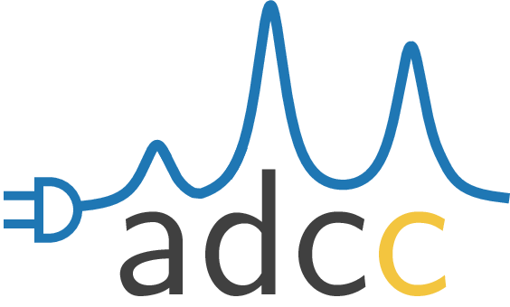

:github_url: https://github.com/adc-connect/adcc/blob/master/docs/index.rst

adcc: Seamlessly connect your program to ADC
============================================

.. image:: https://img.shields.io/github/stars/adc-connect/adcc?style=social
   :target: https://github.com/adc-connect/adcc
.. image:: https://travis-ci.org/adc-connect/adcc.svg?branch=master
   :target: https://travis-ci.org/adc-connect/adcc
.. image:: https://img.shields.io/pypi/v/adcc
   :target: https://pypi.org/project/adcc
.. image:: https://anaconda.org/adcc/adcc/badges/version.svg
   :target: https://anaconda.org/adcc/adcc
.. image:: https://img.shields.io/pypi/l/adcc
   :target: https://github.com/adc-connect/adcc/blob/master/LICENSE

.. note::
   This documentation page is still under construction.

**ADC-connect** -- or adcc in short -- is a Python-based framework to
connect to arbitrary programs and perform calculations based on the
algebraic-diagrammatic construction
approach (ADC) on top of their existing self-consistent field (SCF) procedures.
Four SCF codes can be used with adcc out of the box, namely
`molsturm <https://molsturm.org>`_,
`psi4 <https://github.com/psi4/psi4>`_,
`PySCF <https://github.com/pyscf/pyscf>`_,
and `veloxchem <https://veloxchem.org>`_.

The range of supported algebraic-diagrammatic construction (ADC)
methods includes the ADC(n) family **up to level 3**,
including variants such as spin-flip and core-valence separation.
For all methods transition and excited state **properties are available**.
See the :ref:`performing-calculations` for more details.
Recently we submitted a paper about adcc, see :cite:`adcc`.

.. _index-example:

Getting a first taste
---------------------

The next code snippet should give you an idea, how adcc works in practice.
It shows how an ADC(3) calculation for 3 singlet excited states
of water can be performed on top of a restricted Hartree-Fock reference
computed using PySCF.

.. code-block:: python

    from matplotlib import pyplot as plt
    from pyscf import gto, scf
    import adcc
    
    # Run SCF in pyscf
    mol = gto.M(
        atom='O 0 0 0;'
             'H 0 0 1.795239827225189;'
             'H 1.693194615993441 0 -0.599043184453037',
        basis='cc-pvtz',
        unit="Bohr"
    )
    scfres = scf.RHF(mol)
    scfres.conv_tol = 1e-13
    scfres.kernel()

    # Run an ADC(3) calculation, solving for 3 singlets
    state = adcc.adc3(scfres, n_singlets=3)

    # Broaden the peaks and plot the resulting spectrum
    state.plot_spectrum(broadening='lorentzian')
    plt.show()

Sounds interesting? See :ref:`installation` and :ref:`performing-calculations`
for installation instructions and some more information to get going.

Contents
--------

.. toctree::
   :caption: Introduction
   :maxdepth: 2

   installation
   calculations
   theory

.. toctree::
   :caption: Advanced topics
   :maxdepth: 2

   reference
   hostprograms
   developers
   adccore

.. toctree::
   :caption: Extra information
   :maxdepth: 2

   zpublications
   about

* :ref:`genindex`

